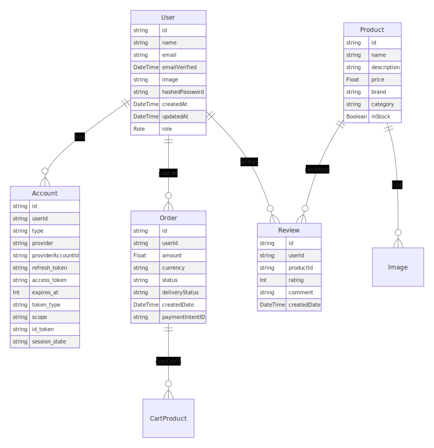

# MVP FullStack E-com Nextjs, Typescript, MongoDB, Firebase, 0Auth, Stripe

Online Store with Admin Dashboard to manage products and orders coupled to a frontend store where people can login and buy.

#ROLES :

USER -> Can create user account and add products to cart to buy them.
ADMIN -> Can add products, remove products, can manage orders.

#TODO :

- Fully Implement Setting for User where can manage Profil, addresses and Payment options or elses
- Implement Updating product from admin dashboard -> Manage Products
- Depend on what product type we sell, update the product prisma model and the front API to fit the needs, also update admin dashboard, frontend product display
- Implement Auto sending email after purchase to confirm ordering seccesfuly
- More responsive design

### smaller updates :

- NavBar.tsx = create svg compatible logo instead of actual Text format.
- NavBar.tsx = Make the design fully responsive
- Admin/NavBar.tsx = Make the design fully responsive
- Add posibility to download Orders from dashboard

# DATABASE :

